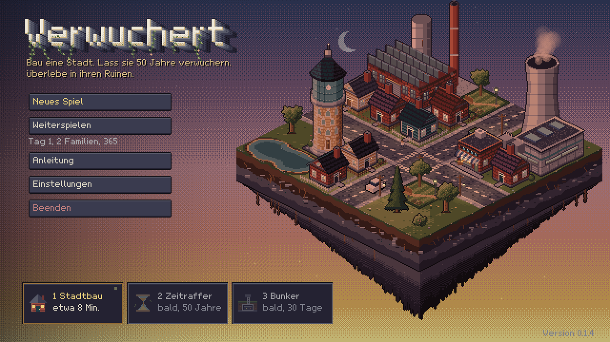
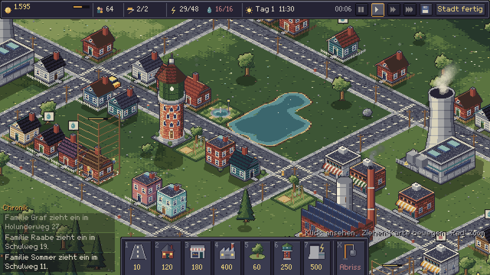
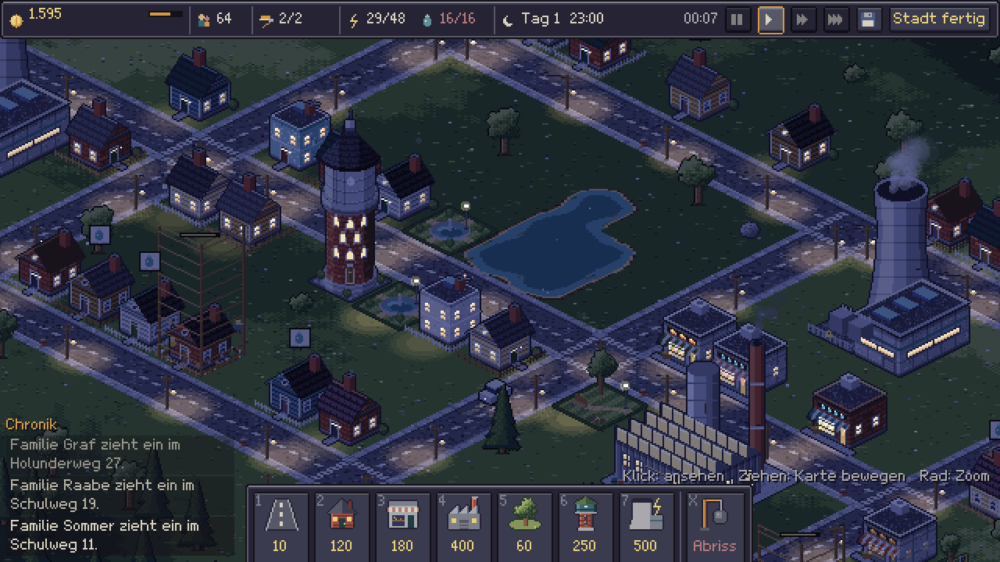
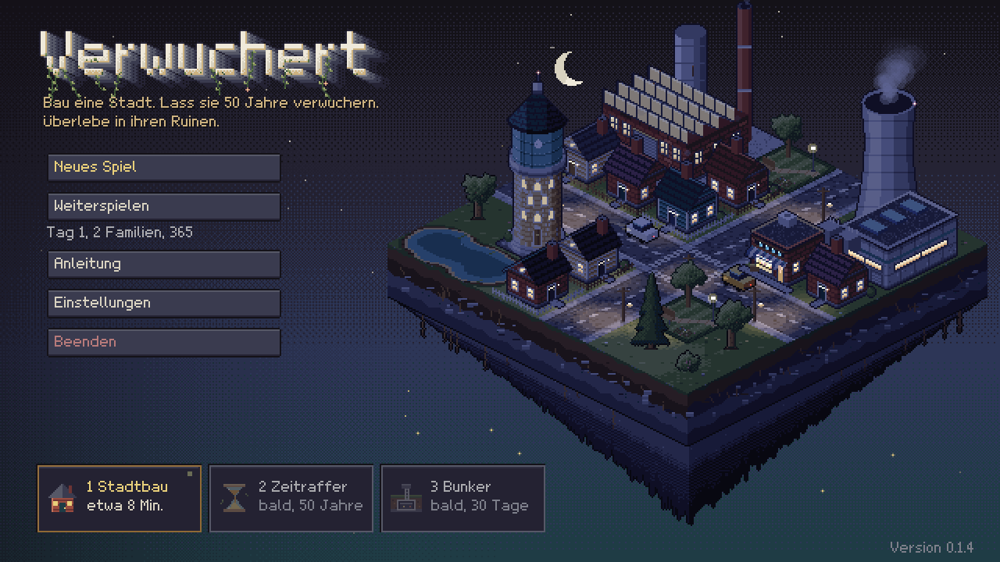

# Verwuchert

Ein 2D-Aufbauspiel in Godot 4.4. Du baust eine kleine Stadt. Danach vergehen 50 Jahre, und die Natur holt sich alles zurück. Zum Schluss baust du mit zwei Überlebenden einen Bunker in den Ruinen deiner eigenen Stadt.

Stand: Version 0.1.4. Phase 1 ist spielbar. Phase 2 und Phase 3 folgen.





## Starten

1. Öffne Godot 4.4.
2. Importiere den Ordner verwuchert/ (die Datei project.godot).
3. Drück F5. Das Spiel startet im Hauptmenü.

## Hauptmenü

Das Menü ist eine schwebende Insel im isometrischen Stil. Auf ihr läuft eine kleine Stadt mit Autos, Fußgängern, Rauch und Strommasten. Ein Tag dauert dort 90 Sekunden, der Himmel wechselt von Tag über Abendrot zur Nacht. Der Titel ist Blockschrift mit Tiefe.

Menüpunkte: Neues Spiel, Weiterspielen (mit Tag, Familien und Geld des Spielstands), Anleitung, Einstellungen und Beenden. In den Einstellungen schaltest du Schatten und Partikel ein oder aus, wählst das Tempo beim Start und löschst bei Bedarf den Spielstand. Die Werte stehen in user://verwuchert_settings.json.



## Im Browser

`web/build.sh` baut die Web-Version nach dist/verwuchert-web/. Godot braucht dafür die Vorlage web_nothreads_release.zip. Die Seite web/page.html lädt die gepackte Engine und die Spieldaten und entpackt sie im Browser.

## Phase 1: Stadtbau

Du hast etwa 8 Minuten. Nach 10 Minuten beginnen die Jahre von selbst. Mit "Stadt fertig" startest du sie früher.

Regeln:

- Wohnhäuser brauchen eine Straße vor der Tür, Strom und Wasser. Erst dann zieht eine Familie mit 4 Leuten ein und zahlt Steuern.
- Leere Häuser zahlen eine kleine Grundsteuer. So kommt immer etwas Geld rein.
- Strom und Wasser fließen über die Straßen. Kraftwerk und Wasserturm brauchen eine Straße daneben. Ein Kraftwerk versorgt 24 Plätze (Häuser und Läden je 1, Fabriken 3), ein Wasserturm 16 Häuser. Die nächsten Gebäude bekommen zuerst etwas.
- Läden verdienen an bewohnten Häusern in der Nähe.
- Fabriken bringen viel Geld, ihr Rauch senkt aber die Steuern der Häuser daneben.
- Parks machen Häuser in der Nähe beliebter.
- Zwei Bautrupps arbeiten gleichzeitig. Weitere Baustellen warten.
- Bäume auf dem Bauplatz kosten 5 zum Fällen. Im Teich kannst du nicht bauen.
- Geld kommt alle 12 Sekunden. Der Balken neben dem Geld zeigt den nächsten Zahltag.

Jede Familie hat einen Namen, jede Straße auch. Die Chronik unten links erzählt, wer einzieht und was öffnet.

Jedes Gebäude speichert Material, Zustand und Inhalt. Ein Laden lagert Konserven, eine Fabrik Metall, ein Wasserturm Rohre. Klick ein Gebäude an, und die Infotafel zeigt alles. Genau das findest du in Phase 3 in den Ruinen.

## Steuerung

- Linksklick: bauen oder Gebäude ansehen
- Linke Taste ziehen: Straße ziehen, mehrere Häuser bauen oder ohne Werkzeug die Karte bewegen
- Rechtsklick: Werkzeug weglegen
- Rechte oder mittlere Taste ziehen: Karte bewegen
- Mausrad, Plus, Minus: Zoom 1x und 2x
- W A S D oder Pfeiltasten: Karte bewegen
- 1 bis 7: Werkzeuge, X: Abriss
- Leertaste: Pause
- F5: Speichern
- Esc: Werkzeug weglegen, sonst Pausenmenü

## Balancing

Alle Zahlen stehen in config/balance.json: Startgeld, Kosten, Bauzeiten, Reichweiten, Steuern, Unterhalt, Tageslänge, Zeitlimit, Material-Gewichte und der Inhalt jedes Gebäudetyps. Änderst du dort etwas, gilt es beim nächsten Start.

Beim Export muss die Datei mit ins Paket. Trag dafür unter Export, Ressourcen, "Filter für Nicht-Ressourcen-Dateien" den Wert `*.json` ein.

## Aufbau

```
verwuchert/
  project.godot
  config/balance.json       Balancing
  autoload/config.gd        liest balance.json
  autoload/game_state.gd    Stadtdaten, Phase, Speichern und Laden
  autoload/settings.gd      Einstellungen des Spielers
  autoload/palette.gd       die 32 Farben (Klasse Pal)
  scenes/                   eine Szene pro Phase und das Hauptmenü
  scripts/city/             Phase 1: Bauen, Gebäude, Bäume, Verkehr, Oberfläche
  scripts/gfx/              Grafik aus Code: Gebäude, Natur, Straßen, Autos, Symbole, Licht, Partikel
  scripts/ui/               Pixel-Schrift, Theme, Menü: Insel, Himmel, Titel, Phasenleiste
  scripts/timelapse/        Phase 2 (noch Platzhalter)
  scripts/bunker/           Phase 3 (folgt)
  shaders/lit.gdshader      färbt die Welt nach Tageszeit
  tests/                    automatische Tests
```

GameState hält die Stadt als reine Daten. Jede Phase liest sie von dort und schreibt ihre Änderungen zurück. Der Spielstand liegt als JSON in `user://verwuchert_save.json`.

## Grafik

Alle Grafiken entstehen beim Start im Code, ohne Bilddateien. Die Ansicht ist isometrisch im Verhältnis 2:1, eine Kachel ist 64 x 32 Pixel groß. Gebäude malt IsoPainter Fläche für Fläche, Boden und Straßen entstehen als Quadrate und werden mit einer Matrix zur Raute gekippt. Die Palette hat 32 gedämpfte Farben. Licht kommt immer von oben links. Das Bild ist 640 x 360 Pixel groß und wird ganzzahlig hochskaliert, mit Nearest-Filter.

## Tests

Die Tests spielen Phase 1 ohne Fenster durch:

```
godot --headless --path verwuchert -s res://tests/play_test.gd
godot --path verwuchert -s res://tests/input_test.gd
godot --headless --path verwuchert -s res://tests/menu_test.gd
```

play_test baut Straßen und Gebäude, lässt die Bautrupps arbeiten, prüft Versorgung und Einnahmen, reißt ab, speichert, lädt und startet Phase 2. input_test klickt mit echten Maus-Ereignissen. menu_test prüft Insel, Seiten, Einstellungen, Löschen und den Start mit dem gewählten Tempo.

Für Bilder ohne Spielen gibt es Schalter nach `--`. Im Menü zeigen `--hour=21` und `--screen=guide` (oder settings, confirm) eine Tageszeit und eine Seite. In der Stadt gilt: `--demo` baut eine Beispielstadt, `--hour=21` stellt die Uhr, `--zoom=2`, `--look=12,8` und `--shot=bild.png` speichern ein Bild.
